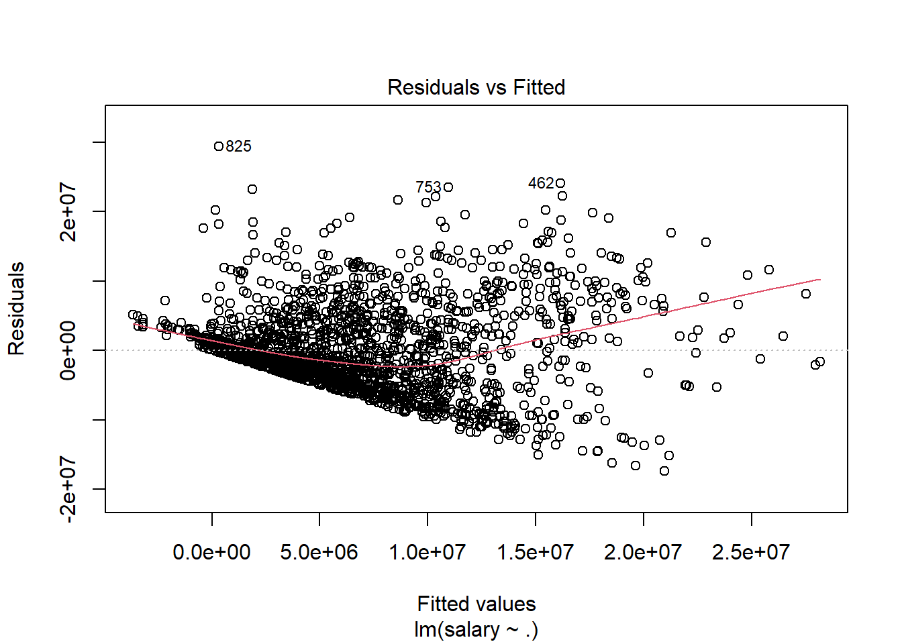
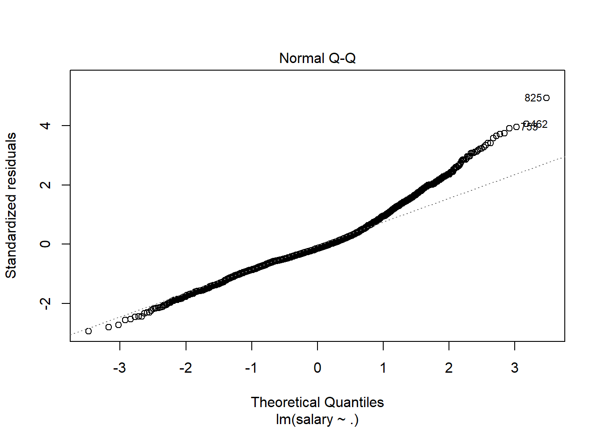
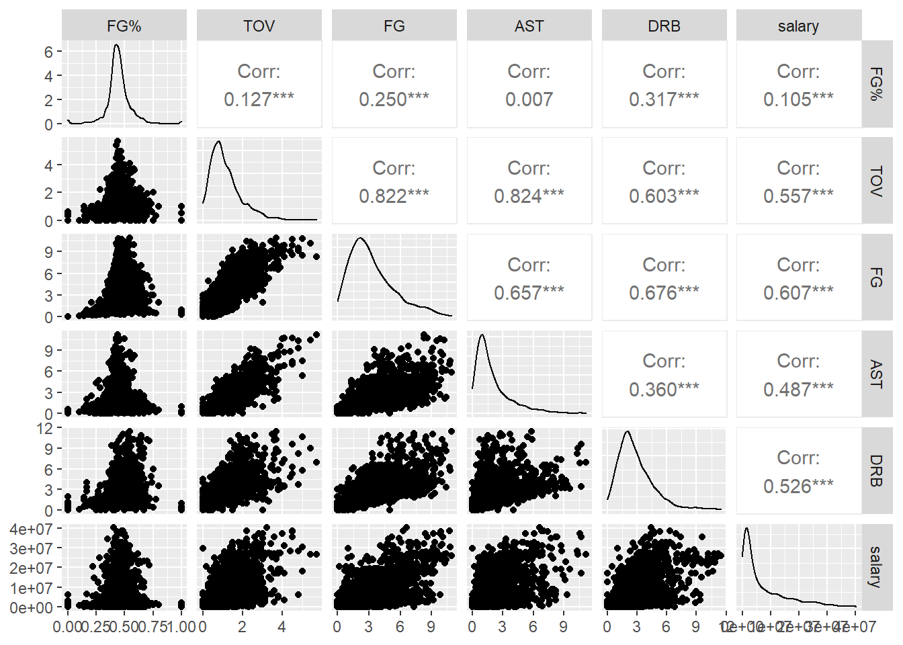
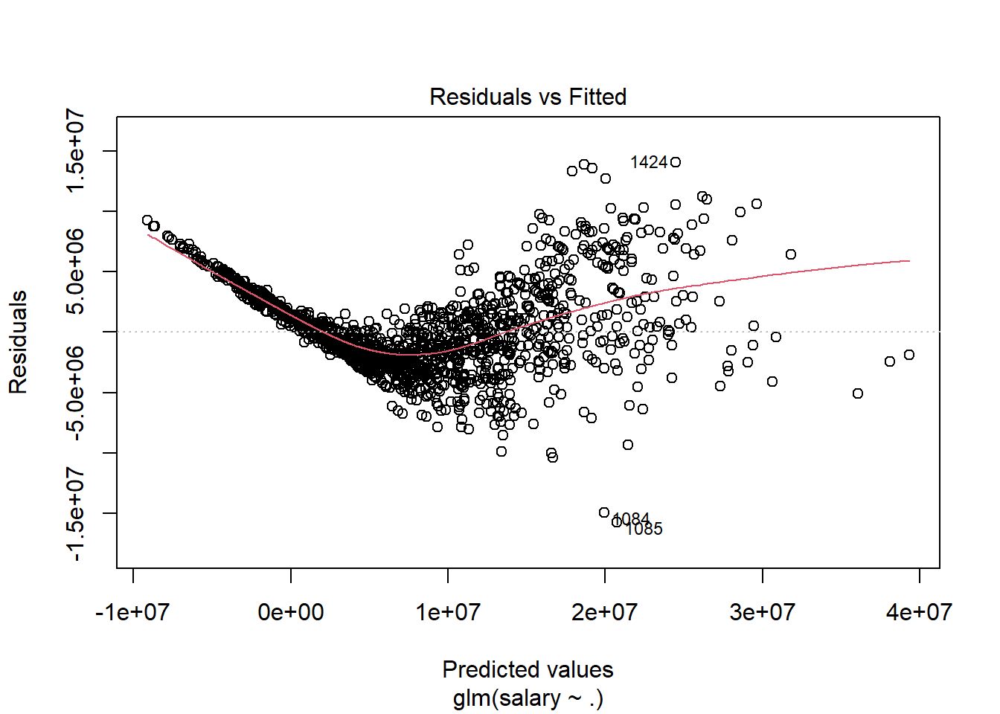
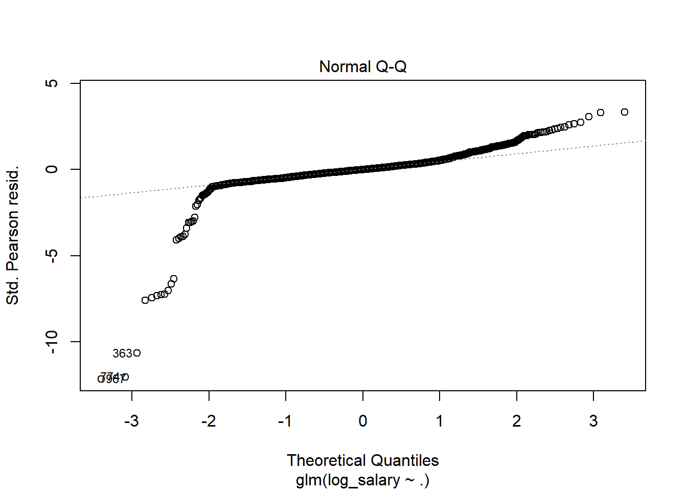
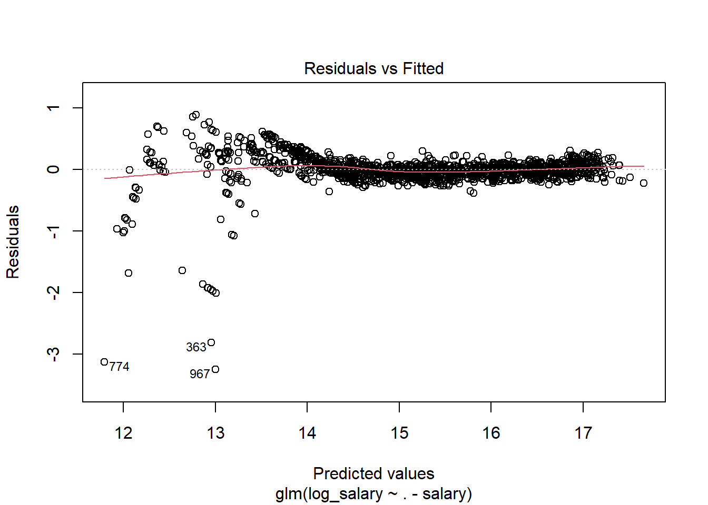
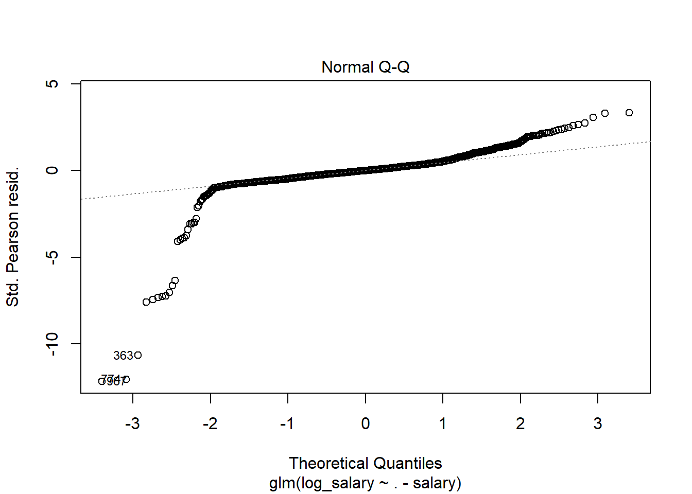
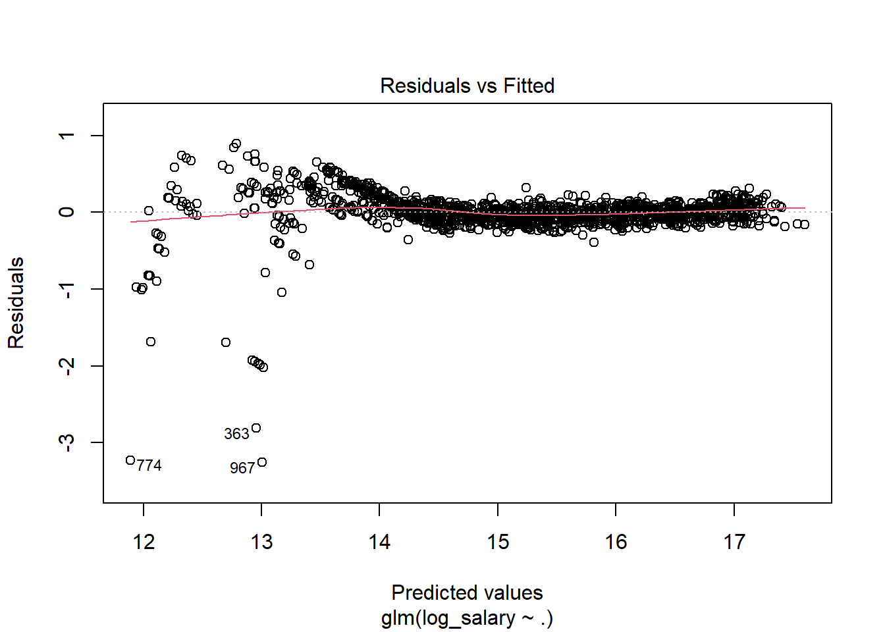

# Baseketballs Brooooo


```r
library(tidyverse)
```

## Importing Data


```r
# players <- read_csv("../data/players.csv")
# stats.36 <- read_csv("../data/PlayerStatisticsPer36Min.csv")
# stats.100 <- read_csv("../data/PlayerStatisticsPer100Poss.csv")
# stats.g <- read_csv("../data/PlayerStatisticsPerGame.csv")
# # salary <- read_csv("../data/salaries_1985to2018.csv")
# salary2 <- read_csv("../data/nba-salaries.csv")
```

## Cleaning and Merging Data


```r
# stats.g <- stats.g %>%
#   mutate(name = str_replace(Player, "\\*", ""))
# stats.g <- stats.g %>%
#   mutate(key = str_c(name, as.character(year), sep = ""))
# salary2 <- salary2 %>%
#   mutate(key = str_c(name, as.character(season), sep = ""))
```

### Joining the Datasets


```r
# final.data <- players %>%
#   inner_join(salary2, by = "name") %>%
#   inner_join(stats.g, by = "key") %>%
#   select(-key) %>%
#   filter(year >= 2017)
# 
# write_csv(final.data, "../data/final_data.csv")

bdata.raw <- read_csv("../data/final_data.csv")
```

```
## Rows: 1995 Columns: 60
```

```
## -- Column specification --------------------------------------------------------
## Delimiter: ","
## chr (21): _id, birthDate, birthPlace, career_FG3%, career_FT%, college, draf...
## dbl (39): career_AST, career_FG%, career_G, career_PER, career_PTS, career_T...
```

```
## 
## i Use `spec()` to retrieve the full column specification for this data.
## i Specify the column types or set `show_col_types = FALSE` to quiet this message.
```

### Deliverabe 2


```r
bdata.raw %>%
  select(`FG%`, TOV, FG, AST, DRB, salary) ->
prelim.data

prelim.lm <- lm(salary ~ ., data = prelim.data)

plot(prelim.lm, which = 1)
```



```r
plot(prelim.lm, which = 2)
```




```r
library(GGally)

ggpairs(prelim.data)
```

```
## Warning: Removed 5 rows containing non-finite values (stat_density).
```

```
## Warning in ggally_statistic(data = data, mapping = mapping, na.rm = na.rm, :
## Removed 5 rows containing missing values

## Warning in ggally_statistic(data = data, mapping = mapping, na.rm = na.rm, :
## Removed 5 rows containing missing values

## Warning in ggally_statistic(data = data, mapping = mapping, na.rm = na.rm, :
## Removed 5 rows containing missing values

## Warning in ggally_statistic(data = data, mapping = mapping, na.rm = na.rm, :
## Removed 5 rows containing missing values

## Warning in ggally_statistic(data = data, mapping = mapping, na.rm = na.rm, :
## Removed 5 rows containing missing values
```

```
## Warning: Removed 5 rows containing missing values (geom_point).

## Warning: Removed 5 rows containing missing values (geom_point).

## Warning: Removed 5 rows containing missing values (geom_point).

## Warning: Removed 5 rows containing missing values (geom_point).

## Warning: Removed 5 rows containing missing values (geom_point).
```



### Cleaning the Data


```r
bdata.raw <- read_csv("../data/final_data.csv")
```

```
## Rows: 1995 Columns: 60
```

```
## -- Column specification --------------------------------------------------------
## Delimiter: ","
## chr (21): _id, birthDate, birthPlace, career_FG3%, career_FT%, college, draf...
## dbl (39): career_AST, career_FG%, career_G, career_PER, career_PTS, career_T...
```

```
## 
## i Use `spec()` to retrieve the full column specification for this data.
## i Specify the column types or set `show_col_types = FALSE` to quiet this message.
```

```r
# displaying null values in each column
bdata.raw %>%
  map_dbl(~sum(is.na(.))) %>%
  unname() ->
na.dbl

na.cols <- data.frame("variable" = colnames(bdata.raw),
                      "null.count" = na.dbl)

na.cols %>%
  filter(null.count > 0)
```

```
##       variable null.count
## 1      college        246
## 2   draft_pick        354
## 3  draft_round        354
## 4   draft_team        354
## 5   draft_year        354
## 6   highSchool        178
## 7          FG%          5
## 8          3P%        123
## 9          2P%         20
## 10        eFG%          5
## 11         FT%         74
```

```r
# parsing numbers from difficult columns
bdata.raw$career_FG3_P <- parse_number(as.character(bdata.raw$`career_FG3%`))
```

```
## Warning: 32 parsing failures.
## row col expected actual
##  13  -- a number      -
##  14  -- a number      -
##  48  -- a number      -
##  49  -- a number      -
##  59  -- a number      -
## ... ... ........ ......
## See problems(...) for more details.
```

```r
bdata.raw$career_FG_P <- parse_number(as.character(bdata.raw$`career_FG%`))
bdata.raw$career_FT_P <- parse_number(as.character(bdata.raw$`career_FT%`))
```

```
## Warning: 8 parsing failures.
## row col expected actual
##  54  -- a number      -
## 165  -- a number      -
## 367  -- a number      -
## 657  -- a number      -
## 901  -- a number      -
## ... ... ........ ......
## See problems(...) for more details.
```

```r
# cleaning height
heights <- str_split(bdata.raw$height, "\\-")
heights.df <- t(data.frame(heights))
heights.int <- as.integer(heights.df[,1]) * 12 + as.integer(heights.df[,2])
bdata.raw$height <- heights.int

bdata.raw %>%
  mutate(draft_pick = parse_number(draft_pick),
         draft_round = parse_number(draft_round),
         shoots_right = ifelse(str_detect(shoots, "Right"),1,0),
         weight = parse_number(weight),
         Pos = as.factor(Pos)) %>%
  rename(career_eFG_P = `career_eFG%`,
         FG_P = `FG%`,
         THREEP_P = `3P%`,
         TWOP_P = `2P%`,
         eFG_P = `eFG%`,
         FT_P = `FT%`) %>%
  select(-birthDate, -birthPlace, -college, -draft_team, -highSchool, -name.x,
         -position.x, -position.y, -team, -Player, -name.y, -season, -Tm,
         -`career_FG3%`, -`career_FG%`, -`career_FT%`, -shoots) %>%
  na.omit() ->
bdata.clean

bdata.clean %>%
  select(-`_id`) ->
bdata.model
```


```r
levels(bdata.model$Pos)
```

```
##  [1] "C"     "C-PF"  "PF"    "PF-C"  "PF-SF" "PG"    "PG-SG" "SF"    "SF-PF"
## [10] "SF-SG" "SG"    "SG-PF" "SG-SF"
```

## Variables Names

 - **salary**: player salary 

## Dimensionality Reduction


```r
ols.init <- glm(salary ~ ., data = bdata.model)

summary(ols.init)
```

```
## 
## Call:
## glm(formula = salary ~ ., data = bdata.model)
## 
## Deviance Residuals: 
##       Min         1Q     Median         3Q        Max  
## -15755754   -2124928    -415935    1604707   14050121  
## 
## Coefficients:
##                Estimate Std. Error t value Pr(>|t|)    
## (Intercept)  -914773678  200747770  -4.557 5.63e-06 ***
## career_AST      -239727     173573  -1.381 0.167452    
## career_G          -5630       1140  -4.940 8.71e-07 ***
## career_PER      -181302      82704  -2.192 0.028527 *  
## career_PTS       187086      69830   2.679 0.007465 ** 
## career_TRB        -6812     137756  -0.049 0.960570    
## career_WS         88540       7571  11.694  < 2e-16 ***
## career_eFG_P    -103653      66765  -1.552 0.120762    
## draft_pick         7729      13171   0.587 0.557414    
## draft_round      475426     384951   1.235 0.217021    
## draft_year        32490      56391   0.576 0.564596    
## height            -6064      64643  -0.094 0.925280    
## weight            14601       7739   1.887 0.059407 .  
## rank             -38959        821 -47.455  < 2e-16 ***
## PosC-PF         -714114    1761181  -0.405 0.685189    
## PosPF            576026     386674   1.490 0.136523    
## PosPF-C          545846    3492181   0.156 0.875814    
## PosPF-SF        4584631    2053409   2.233 0.025722 *  
## PosPG           1290198     749966   1.720 0.085585 .  
## PosPG-SG        2495025    3583745   0.696 0.486412    
## PosSF            590620     523142   1.129 0.259091    
## PosSF-PF        2403842    3559383   0.675 0.499559    
## PosSF-SG        3750450    2080059   1.803 0.071589 .  
## PosSG           1014994     624927   1.624 0.104556    
## PosSG-PF       -2238107    3531525  -0.634 0.526344    
## Age              188241      66353   2.837 0.004618 ** 
## G                -30452       5393  -5.646 1.97e-08 ***
## GS                14751       6029   2.446 0.014545 *  
## MP               -75058      41448  -1.811 0.070364 .  
## FG              1446885    2795188   0.518 0.604793    
## FGA              713726    1822029   0.392 0.695323    
## FG_P            9702979    7758057   1.251 0.211248    
## `3P`           -2016198    2520832  -0.800 0.423950    
## `3PA`           -282851    1822207  -0.155 0.876666    
## THREEP_P          95107    1237577   0.077 0.938754    
## `2P`           -1120449    1942447  -0.577 0.564149    
## `2PA`          -1134526    1828419  -0.620 0.535030    
## TWOP_P         -1104987    2612646  -0.423 0.672404    
## eFG_P         -11530045    6796468  -1.696 0.090011 .  
## FT                27286    1311556   0.021 0.983405    
## FTA              277762     471193   0.589 0.555627    
## FT_P               4629    1152985   0.004 0.996797    
## ORB             1166229    1862044   0.626 0.531206    
## DRB              876294    1852738   0.473 0.636305    
## TRB             -643544    1849904  -0.348 0.727981    
## AST              519556     168758   3.079 0.002118 ** 
## STL             -348228     352860  -0.987 0.323870    
## BLK              128134     352989   0.363 0.716661    
## TOV             -318183     337280  -0.943 0.345644    
## PF              -849309     220592  -3.850 0.000123 ***
## PTS              233261    1225145   0.190 0.849026    
## year             427471     108145   3.953 8.10e-05 ***
## career_FG3_P     -13774      19872  -0.693 0.488316    
## career_FG_P       79352      74266   1.068 0.285480    
## career_FT_P      -14346      15548  -0.923 0.356313    
## shoots_right    1023227     348688   2.935 0.003394 ** 
## ---
## Signif. codes:  0 '***' 0.001 '**' 0.01 '*' 0.05 '.' 0.1 ' ' 1
## 
## (Dispersion parameter for gaussian family taken to be 1.192076e+13)
## 
##     Null deviance: 1.0036e+17  on 1499  degrees of freedom
## Residual deviance: 1.7214e+16  on 1444  degrees of freedom
## AIC: 49478
## 
## Number of Fisher Scoring iterations: 2
```

```r
plot(ols.init, which = 1)
```



```r
plot(ols.init, which = 2)
```

```
## Warning: not plotting observations with leverage one:
##   251, 835, 1385
```




```r
library(klaR)
library(car)

cond.index(ols.init, bdata.model)
```

```
##  [1]     1.000000     3.809463     4.683222     5.776779     6.075979
##  [6]     6.175553     6.181557     6.187813     6.189636     6.190304
## [11]     6.191519     6.227108     6.898131     7.469383     9.971058
## [16]    10.529233    12.003566    13.408319    14.529855    15.554897
## [21]    17.474493    18.242247    19.980591    20.567317    22.459942
## [26]    23.340562    23.682664    25.465991    26.807971    29.795880
## [31]    32.829153    34.147595    37.342758    41.560963    44.365255
## [36]    48.578252    55.395701    62.415741    63.912511    76.397474
## [41]    88.729640   104.337262   107.958735   120.982114   126.749219
## [46]   140.754872   146.878493   249.184746   384.392294   415.104746
## [51]   663.299314   763.302463  1229.204938  1495.417758  9519.424827
## [56] 19898.973987
```

```r
vif(ols.init)
```

```
##                     GVIF Df GVIF^(1/(2*Df))
## career_AST     10.512650  1        3.242322
## career_G       14.650969  1        3.827658
## career_PER     13.817175  1        3.717146
## career_PTS     15.296020  1        3.911013
## career_TRB     11.357592  1        3.370103
## career_WS       6.661413  1        2.580971
## career_eFG_P   10.980199  1        3.313638
## draft_pick      5.199178  1        2.280171
## draft_round     4.382056  1        2.093336
## draft_year      8.917784  1        2.986266
## height          5.706988  1        2.388930
## weight          4.213725  1        2.052736
## rank            1.802270  1        1.342487
## Pos            26.457213 11        1.160543
## Age            10.325382  1        3.213313
## G               1.914364  1        1.383605
## GS              3.472569  1        1.863483
## MP             14.845280  1        3.852957
## FG           4749.544498  1       68.916939
## FGA          8882.631015  1       94.247711
## FG_P           41.881914  1        6.471624
## `3P`          535.527929  1       23.141476
## `3PA`        1867.209766  1       43.211223
## THREEP_P        2.819211  1        1.679051
## `2P`         1602.385660  1       40.029810
## `2PA`        5040.161082  1       70.994092
## TWOP_P          6.299057  1        2.509792
## eFG_P          28.230651  1        5.313252
## FT            459.730431  1       21.441325
## FTA            88.180011  1        9.390421
## FT_P            2.548837  1        1.596508
## ORB           247.449516  1       15.730528
## DRB          1397.680607  1       37.385567
## TRB          2475.661708  1       49.756022
## AST            11.995422  1        3.463441
## STL             2.789140  1        1.670072
## BLK             2.548260  1        1.596327
## TOV             9.742487  1        3.121296
## PF              3.036228  1        1.742477
## PTS          7208.419275  1       84.902410
## year            1.813846  1        1.346791
## career_FG3_P    3.474553  1        1.864015
## career_FG_P    19.688823  1        4.437209
## career_FT_P     2.691603  1        1.640611
## shoots_right    1.091625  1        1.044808
```

## Transforming the Respsonse Variable


```r
bdata.model %>%
  mutate(log_salary = log(salary)) -> 
bdata.model
```


```r
ols.log <- glm(log_salary ~ . - salary, data = bdata.model)

summary(ols.log)
```

```
## 
## Call:
## glm(formula = log_salary ~ . - salary, data = bdata.model)
## 
## Deviance Residuals: 
##     Min       1Q   Median       3Q      Max  
## -3.2516  -0.0775   0.0002   0.0844   0.8916  
## 
## Coefficients:
##                Estimate Std. Error  t value Pr(>|t|)    
## (Intercept)  -1.846e+02  1.568e+01  -11.779  < 2e-16 ***
## career_AST   -1.444e-02  1.355e-02   -1.065   0.2870    
## career_G      1.561e-05  8.899e-05    0.175   0.8607    
## career_PER   -1.116e-02  6.458e-03   -1.729   0.0841 .  
## career_PTS    9.995e-03  5.453e-03    1.833   0.0670 .  
## career_TRB   -1.670e-02  1.076e-02   -1.552   0.1208    
## career_WS     3.227e-03  5.912e-04    5.459 5.63e-08 ***
## career_eFG_P -5.232e-03  5.213e-03   -1.004   0.3158    
## draft_pick   -2.419e-04  1.028e-03   -0.235   0.8141    
## draft_round   1.407e-01  3.006e-02    4.680 3.14e-06 ***
## draft_year    1.053e-02  4.403e-03    2.391   0.0169 *  
## height       -3.368e-03  5.048e-03   -0.667   0.5047    
## weight        5.133e-04  6.043e-04    0.849   0.3958    
## rank         -8.348e-03  6.411e-05 -130.225  < 2e-16 ***
## PosC-PF       7.185e-02  1.375e-01    0.522   0.6014    
## PosPF         8.784e-03  3.019e-02    0.291   0.7712    
## PosPF-C      -7.637e-02  2.727e-01   -0.280   0.7795    
## PosPF-SF      1.310e-01  1.603e-01    0.817   0.4140    
## PosPG         5.166e-02  5.856e-02    0.882   0.3778    
## PosPG-SG      4.549e-01  2.798e-01    1.626   0.1042    
## PosSF         2.543e-02  4.085e-02    0.622   0.5338    
## PosSF-PF      5.459e-01  2.779e-01    1.964   0.0497 *  
## PosSF-SG      6.888e-02  1.624e-01    0.424   0.6716    
## PosSG        -1.972e-03  4.880e-02   -0.040   0.9678    
## PosSG-PF     -2.367e-01  2.758e-01   -0.858   0.3908    
## Age          -3.367e-03  5.181e-03   -0.650   0.5159    
## G             2.103e-03  4.211e-04    4.993 6.65e-07 ***
## GS           -5.962e-04  4.708e-04   -1.266   0.2056    
## MP            5.297e-04  3.236e-03    0.164   0.8700    
## FG           -2.150e-02  2.183e-01   -0.098   0.9215    
## FGA          -2.033e-01  1.423e-01   -1.429   0.1533    
## FG_P         -4.981e-01  6.058e-01   -0.822   0.4110    
## `3P`         -1.132e-01  1.968e-01   -0.575   0.5654    
## `3PA`         1.912e-01  1.423e-01    1.344   0.1793    
## THREEP_P     -1.505e-01  9.664e-02   -1.558   0.1195    
## `2P`         -4.595e-02  1.517e-01   -0.303   0.7620    
## `2PA`         1.900e-01  1.428e-01    1.331   0.1834    
## TWOP_P       -2.333e-01  2.040e-01   -1.144   0.2530    
## eFG_P         4.765e-01  5.307e-01    0.898   0.3694    
## FT            5.493e-03  1.024e-01    0.054   0.9572    
## FTA          -6.444e-02  3.679e-02   -1.751   0.0801 .  
## FT_P          1.619e-02  9.003e-02    0.180   0.8573    
## ORB           5.575e-02  1.454e-01    0.383   0.7015    
## DRB           6.996e-02  1.447e-01    0.484   0.6288    
## TRB          -5.668e-02  1.444e-01   -0.392   0.6948    
## AST          -2.261e-02  1.318e-02   -1.716   0.0865 .  
## STL           5.761e-03  2.755e-02    0.209   0.8344    
## BLK           3.487e-02  2.756e-02    1.265   0.2061    
## TOV           1.072e-01  2.634e-02    4.072 4.92e-05 ***
## PF           -2.682e-02  1.722e-02   -1.557   0.1197    
## PTS           4.435e-02  9.566e-02    0.464   0.6430    
## year          8.963e-02  8.444e-03   10.614  < 2e-16 ***
## career_FG3_P  1.423e-03  1.552e-03    0.917   0.3592    
## career_FG_P   3.123e-03  5.799e-03    0.539   0.5902    
## career_FT_P  -1.529e-03  1.214e-03   -1.260   0.2080    
## shoots_right  2.953e-02  2.723e-02    1.085   0.2783    
## ---
## Signif. codes:  0 '***' 0.001 '**' 0.01 '*' 0.05 '.' 0.1 ' ' 1
## 
## (Dispersion parameter for gaussian family taken to be 0.07268331)
## 
##     Null deviance: 2362.26  on 1499  degrees of freedom
## Residual deviance:  104.95  on 1444  degrees of freedom
## AIC: 381.28
## 
## Number of Fisher Scoring iterations: 2
```

```r
plot(ols.log, which = 1)
```



```r
plot(ols.log, which = 2)
```

```
## Warning: not plotting observations with leverage one:
##   251, 835, 1385
```


## Pieceise Model


```r
fit.piecewise = lm(log_salary ~ . - salary - year + I((year-2013) * (year>2013)), data=bdata.model)

summary(fit.piecewise)
```

```
## 
## Call:
## lm(formula = log_salary ~ . - salary - year + I((year - 2013) * 
##     (year > 2013)), data = bdata.model)
## 
## Residuals:
##     Min      1Q  Median      3Q     Max 
## -3.2516 -0.0775  0.0002  0.0844  0.8916 
## 
## Coefficients:
##                                    Estimate Std. Error  t value Pr(>|t|)    
## (Intercept)                      -4.215e+00  8.914e+00   -0.473   0.6364    
## career_AST                       -1.444e-02  1.355e-02   -1.065   0.2870    
## career_G                          1.561e-05  8.899e-05    0.175   0.8607    
## career_PER                       -1.116e-02  6.458e-03   -1.729   0.0841 .  
## career_PTS                        9.995e-03  5.453e-03    1.833   0.0670 .  
## career_TRB                       -1.670e-02  1.076e-02   -1.552   0.1208    
## career_WS                         3.227e-03  5.912e-04    5.459 5.63e-08 ***
## career_eFG_P                     -5.232e-03  5.213e-03   -1.004   0.3158    
## draft_pick                       -2.419e-04  1.028e-03   -0.235   0.8141    
## draft_round                       1.407e-01  3.006e-02    4.680 3.14e-06 ***
## draft_year                        1.053e-02  4.403e-03    2.391   0.0169 *  
## height                           -3.368e-03  5.048e-03   -0.667   0.5047    
## weight                            5.133e-04  6.043e-04    0.849   0.3958    
## rank                             -8.348e-03  6.411e-05 -130.225  < 2e-16 ***
## PosC-PF                           7.185e-02  1.375e-01    0.522   0.6014    
## PosPF                             8.784e-03  3.019e-02    0.291   0.7712    
## PosPF-C                          -7.637e-02  2.727e-01   -0.280   0.7795    
## PosPF-SF                          1.310e-01  1.603e-01    0.817   0.4140    
## PosPG                             5.166e-02  5.856e-02    0.882   0.3778    
## PosPG-SG                          4.549e-01  2.798e-01    1.626   0.1042    
## PosSF                             2.543e-02  4.085e-02    0.622   0.5338    
## PosSF-PF                          5.459e-01  2.779e-01    1.964   0.0497 *  
## PosSF-SG                          6.888e-02  1.624e-01    0.424   0.6716    
## PosSG                            -1.972e-03  4.880e-02   -0.040   0.9678    
## PosSG-PF                         -2.367e-01  2.758e-01   -0.858   0.3908    
## Age                              -3.367e-03  5.181e-03   -0.650   0.5159    
## G                                 2.103e-03  4.211e-04    4.993 6.65e-07 ***
## GS                               -5.962e-04  4.708e-04   -1.266   0.2056    
## MP                                5.297e-04  3.236e-03    0.164   0.8700    
## FG                               -2.150e-02  2.183e-01   -0.098   0.9215    
## FGA                              -2.033e-01  1.423e-01   -1.429   0.1533    
## FG_P                             -4.981e-01  6.058e-01   -0.822   0.4110    
## `3P`                             -1.132e-01  1.968e-01   -0.575   0.5654    
## `3PA`                             1.912e-01  1.423e-01    1.344   0.1793    
## THREEP_P                         -1.505e-01  9.664e-02   -1.558   0.1195    
## `2P`                             -4.595e-02  1.517e-01   -0.303   0.7620    
## `2PA`                             1.900e-01  1.428e-01    1.331   0.1834    
## TWOP_P                           -2.333e-01  2.040e-01   -1.144   0.2530    
## eFG_P                             4.765e-01  5.307e-01    0.898   0.3694    
## FT                                5.493e-03  1.024e-01    0.054   0.9572    
## FTA                              -6.444e-02  3.679e-02   -1.751   0.0801 .  
## FT_P                              1.619e-02  9.003e-02    0.180   0.8573    
## ORB                               5.575e-02  1.454e-01    0.383   0.7015    
## DRB                               6.996e-02  1.447e-01    0.484   0.6288    
## TRB                              -5.668e-02  1.444e-01   -0.392   0.6948    
## AST                              -2.261e-02  1.318e-02   -1.716   0.0865 .  
## STL                               5.761e-03  2.755e-02    0.209   0.8344    
## BLK                               3.487e-02  2.756e-02    1.265   0.2061    
## TOV                               1.072e-01  2.634e-02    4.072 4.92e-05 ***
## PF                               -2.682e-02  1.722e-02   -1.557   0.1197    
## PTS                               4.435e-02  9.566e-02    0.464   0.6430    
## career_FG3_P                      1.423e-03  1.552e-03    0.917   0.3592    
## career_FG_P                       3.123e-03  5.799e-03    0.539   0.5902    
## career_FT_P                      -1.529e-03  1.214e-03   -1.260   0.2080    
## shoots_right                      2.953e-02  2.723e-02    1.085   0.2783    
## I((year - 2013) * (year > 2013))  8.963e-02  8.444e-03   10.614  < 2e-16 ***
## ---
## Signif. codes:  0 '***' 0.001 '**' 0.01 '*' 0.05 '.' 0.1 ' ' 1
## 
## Residual standard error: 0.2696 on 1444 degrees of freedom
## Multiple R-squared:  0.9556,	Adjusted R-squared:  0.9539 
## F-statistic: 564.7 on 55 and 1444 DF,  p-value: < 2.2e-16
```

```r
plot(fit.piecewise, which = c(1, 2))
```

```
## Warning: not plotting observations with leverage one:
##   251, 835, 1385
```




### Ridge/LASSO

### Feature Engineering

## Modeling

Possible Models:

OLS Regression

WLS Regression

GLM Regression

Regression Trees

Splines


